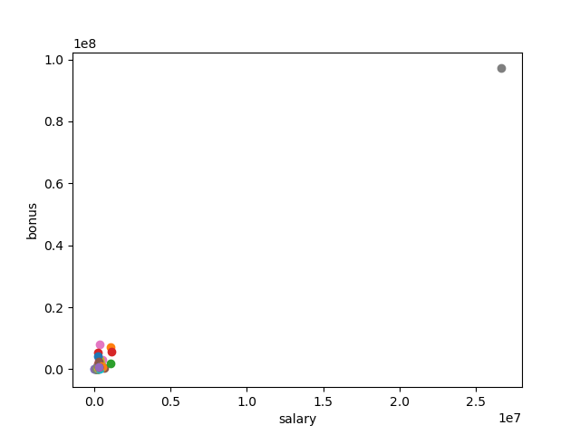
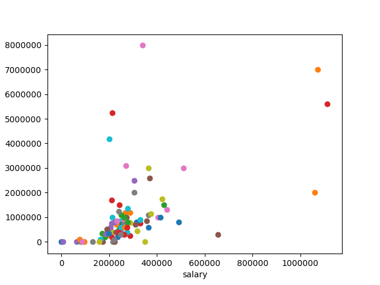
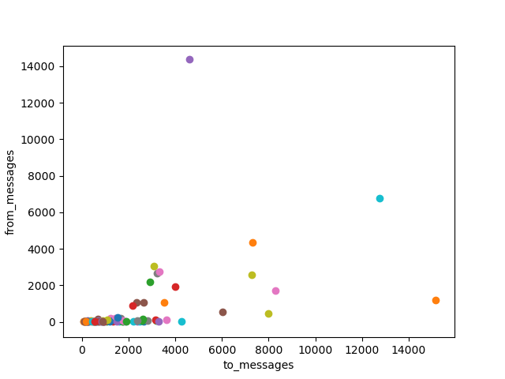
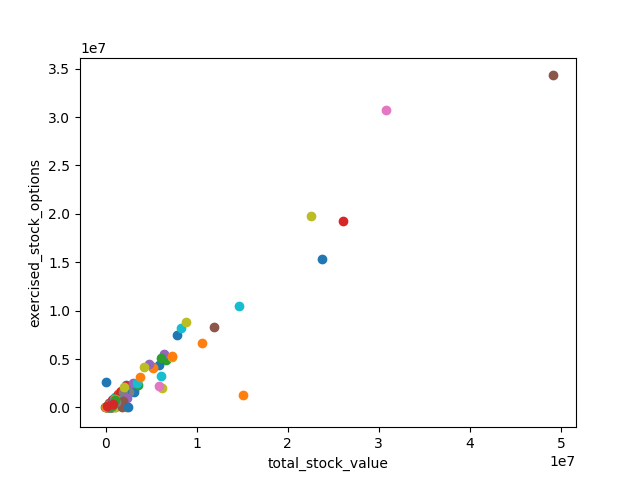
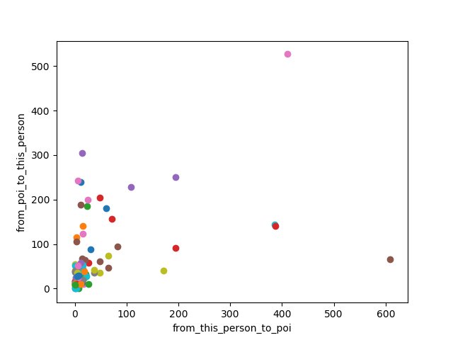

# Identify Fraud From Enron Email
#### Udacity Data Analyst Nanodegree — Project 7

## Introduction
In 2000, Enron was one of the largest companies in the United States. By 2002, it had collapsed into bankruptcy due to widespread corporate fraud. In the resulting Federal investigation, a significant amount of typically confidential information entered into the public record, including tens of thousands of emails and detailed financial data for top executives.

Using all the concepts and ideas learned through the *Introduction to Machine Learning* module within the Udacity's Data Analyst NanoDegree, this project will use the `scikit-learn` [Python library](http://scikit-learn.org/stable/) and machine learning techniques to predict and spot culpable persons of the Enron scandal.

## How The Project Works
The project contains four main folders:

* `code`: Python main scripts
* `data`: data sets used throughout the project
* `misc`: several assets, such as images, generated to illustrate the `README.md`
* `tools`: support functions for the main scripts

The `code` folder contains all the scripts that run the project. The main script is `poi_id.py` which needs to be run first in order to generate the models for `tester.py` to yield the right results.

Besides `poi_id.py` all the `poi_*.py` scripts contain the functions called from the main script. Their "surname" describe which section each file tackles and which stage of the project the code belongs.

> i.e. the `poi_plot.py` contains all the plotting functions, while the `poi_explore.py` contains all the functions used during the feature exploration phase.

The final structure of the code is the following:

* `poi_id.py`: main script, which shares the structure with `README.md`
  * `poi_plot.py`: contains all the plotting functions
  * `poi_explore.py`: contains all the functions related to the data exploration
  * `poy_select.py`: contains all the functions related to the feature selection
  * `poy_tune.py`: contains all the functions related to algorithm tuning
* `tester.py`: script used to test the algorithm performance

All the project questions are answered directly in the `README.md` document. Despite `README.md` contains plenty of code snippets, the project flow has been designed to jump between `README.md` and `poi_*.py` scripts for further reference and in order to better understand the code being discussed at any given time.

In order to facilitate readability, both `README.md` and `poi_*.py` files share the same structure:

* Data Exploration: related to *data exploration* and *outlier detection*.
* Selected Features: related to *create new features*, *intelligently select features* and *properly scale features*.
* Algorithm Tuning: related to *parameter tuning* and *validation strategy*.
* Final Model

### Other Things You Should Know
In the main script, `poi_id.py`, line 15, you'll find the `print_*` knobs. Their main use is to turn on/off different printing functions of the code, in order to avoid dozens of lines appearing in the console when running `poi_id.py`.

All the printing functions called from `poi_id.py` are wrapped inside a conditional statement that points to these Booleans.

The printing variables themselves are also segmented. The gist of it being that if you wanted to print only the code from the Data Exploration phase, you should only "turn" the switch `print_explore` to `True`.

From a functionality perspective, all the work is done regardless of these switches, then its use is merely cosmetic and should not affect the final results.

## Data Exploration
> Summarize for us the goal of this project and how machine learning is useful in trying to accomplish it. As part of your answer, give some background on the data set and how it can be used to answer the project question. Were there any outliers in the data when you got it, and how did you handle those?

The main goal of this project is to use both financial and email data from Enron to build a predictive model that could potentially identify a "person of interest" (POI), i.e. Enron employees who may have committed fraud, based on the aforementioned public data.

### Data Structure
As part of the preprocessing for this project, the email and financial data from Enron has been combined into a dictionary, where each key-value pair corresponds to one person.

The dictionary key is the person's name, and the value is another dictionary, which contains the names of all the features and their values for that person.

Additionally, the features always fall into three major types:

* Financial features (all units in US dollars):
  * `salary`
  * `deferral_payments`
  * `total_payments`
  * `loan_advances`
  * `bonus`
  * `restricted_stock_deferred`
  * `deferred_income`
  * `total_stock_value`
  * `expenses`
  * `exercised_stock_options`
  * `other`
  * `long_term_incentive`
  * `restricted_stock`
  * `director_fees`
* Email features (units are number of emails messages; except `email_address`, which is a text string):
  * `to_messages`
  * `email_address`
  * `from_poi_to_this_person`
  * `from_messages`
  * `from_this_person_to_poi`
  * `shared_receipt_with_poi`
* POI labels (boolean, represented as integer):
  * `poi`

Here's a real example extracted from the data set.
```
"SKILLING JEFFREY K":
  {'salary': 1111258,
  'to_messages': 3627,
  'deferral_payments': 'NaN',
  'total_payments': 8682716,
  'exercised_stock_options': 19250000,
  'bonus': 5600000,
  'restricted_stock': 6843672,
  'shared_receipt_with_poi': 2042,
  'restricted_stock_deferred': 'NaN',
  'total_stock_value': 26093672,
  'expenses': 29336,
  'loan_advances': 'NaN',
  'from_messages': 108,
  'other': 22122,
  'from_this_person_to_poi': 30,
  'poi': True,
  'director_fees': 'NaN',
  'deferred_income': 'NaN',
  'long_term_incentive': 1920000,
  'email_address': 'jeff.skilling@enron.com',
  'from_poi_to_this_person': 88}
```

A quick overview of the data set provides some highlights about its structure and main characteristics:

* Financial features: 14
* Email features: 6
* POI label: 1
* Dataset length: 146
* Number of POI: 18
* Percentage of POI: 12.3%

### NaNs
Despite overall having really valuable information in order to identify POIs, the data set also contained a lot of missing values — NaN.

Here's a table showing the amount of NaN values per feature.

| Feature | NaNs |
|:-------:|:----:|
| Loan advances | 142 |
| Director fees | 129 |
| Restricted stock deferred | 128 |
| Deferred payment | 107 |
| Deferred income | 97 |
| Long term incentive | 80 |
| Bonus | 64 |
| Emails sent also to POI | 60 |
| From messages (emails sent) | 60 |
| To messages (emails received) | 60 |
| Emails from POI (emails received from POI) | 60 |
| Emails to POI (emails sent to POI) | 60 |
| Other | 53 |
| Expenses | 51 |
| Salary | 51 |
| Exercised stock options | 44 |
| Restricted stock | 36 |
| Email address | 35 |
| Total payment | 21 |
| Total stock value | 20 |

The data definitely has a lot of NaNs, the most concerning features are `Loan advances`, `Director fees` and `Restricted stock deferred`, which have more than 85% of their values missing.

At this point no data will be discarded, waiting until further Feature Selection to spot the most influential features. Despite, for the financial features, one way to interpret the NaNs is that they are equivalent to a zero.

There is a case to be made that if an employee did not receive restricted stock, the value could be zero. On top of that, this hypothesis is also supported by the `insider-pay.pdf`, that can be found in the `misc` folder, in how the totals are calculated.

For these reasons, NaN values in only financial features will be replaced by zeros.

### Outliers
The outlier explorations starts by plotting two of the most telling features when it comes to uncover the relation between the data and POIs: `salary` and `bonus`.



The plot clearly shows an outlier in the top right of the plot. Ordering the list by salary, the outlier is called `TOTAL`, which represents the sum of all the salaries, as shown in the `insider-pay.pdf`, therefore cannot be considered a person.

After removing `TOTAL` here's the same plot again.



It looks like there still are four additional points with higher salary and bonus, in a range that could potentially consider them as outliers.

| Person Name | Salary | isPOI |
|:-----------:|:------:|:-----:|
| SKILLING JEFFREY K | 1111258 | True |
| LAY KENNETH L | 1072321 | True |
| FREVERT MARK A | 1060932 | False |
| PICKERING MARK R | 655037 | False |

After closer inspection, and despite not all of them were POIs, the rest of their data seemed consistent across the board and all of them looked like valid and meaningful data points.

**Incomplete Data**

Another potential source of outliers are the ones that don't add meaningful information to the mix, such as persons with little or no relevant information at all.

In order to spot these data points, the `get_incompletes()` function returns a list of the names with no feature data above a certain threshold.

With `get_incompletes()` set at 90%, which means that the persons returned by the function have only less than 10% of the data completed, it returns this list.

```
['WHALEY DAVID A',
 'WROBEL BRUCE',
 'LOCKHART EUGENE E',
 'THE TRAVEL AGENCY IN THE PARK',
 'GRAMM WENDY L']
```

After inspecting closely each person one by one, there's no meaningful information we can derive from these persons and on top of that, none of each is a POI, therefore, they will be removed from the data set.

**Additional Plots**

The image below plots the amount of email `from_messages` and `to_messages` sent or received from each person.



This plot does appear to contain some outliers. There are three suspicious persons that send / receive way more email than what would be considered average.

For example, the farthest point on the right sent over 14000 emails, with the closest being less than a half. The points outside the main cluster are identified below.

```
  ['KAMINSKI WINCENTY J',
   'KEAN STEVEN J',
   'SHAPIRO RICHARD S']
```

Besides sending / receiving a ton of email, it seems there is apparently nothing strange about these persons. In an enterprise like Enron, it is totally possible to have certain jobs / roles that involve heavier email use. For this reason these three person won't be discarded.

Additionally below are included other interesting plots from the exploration.

`exercised_stock_options` vs. `total_stock_value`



All the data seems clustered between a certain range, except for four outliers. Two of them are already usual suspects: `LAY KENNETH L` and `SKILLING JEFFREY K`, the other two, `HIRKO JOSEPH` and `PAI LOU L` (POI), don't look like outliers after careful inspection of their records.

`from_poi_to_this_person` vs. `from_this_person_to_poi`



Despite they can't be considered outliers, since the values stay within a reasonable range, there are four persons: `DELAINEY DAVID W` (POI himself), `LAVORATO JOHN J`, `KEAN STEVEN J`, `BECK SALLY W`, that send a huge amount of email to POIs.

After close inspection of the rest of the features, the same names keep showing up. If we wouldn't know part of the story, some persons — like `LAY KENNETH L` and `SKILLING JEFFREY K`, would probably classify as outliers. Even after removing `TOTAL`, they keep showing up at the higher band of all the financial related plots, like `total_payments`. But since they played a key role in the development of the story, they must stay, and with that the outlier inspection should be considered completed.

Finally, the updated data set that will be used for the upcoming sections has the following characteristics:

* Dataset length: 140
* Number of POI: 18
* Percentage of POI: 12.9%


## Selected Features
> What features did you end up using in your POI identifier, and what selection process did you use to pick them? Did you have to do any scaling? Why or why not? As part of the assignment, you should attempt to engineer your own feature that does not come ready-made in the data set -- explain what feature you tried to make, and the rationale behind it.

### Pre Assessment
Before jumping straight into engineering and selecting features or even scaling algorithms, lets assess first out of the box the performance of three different algorithms (decided upon [documentation](http://scikit-learn.org/stable/tutorial/machine_learning_map/) from `sklearn`). The goal is to use the results yielded in this section as a base line to benchmark once the new features are added or the scaling is performed.

The three selected algorithms are:

* [AdaBoost](http://scikit-learn.org/stable/modules/generated/sklearn.ensemble.AdaBoostClassifier.html)
* [Random Forest](http://scikit-learn.org/stable/modules/generated/sklearn.ensemble.RandomForestClassifier.html#sklearn.ensemble.RandomForestClassifier)
* [SVC](http://scikit-learn.org/stable/modules/generated/sklearn.svm.SVC.html#sklearn.svm.SVC)

#### Performance Review: out of the box
These are Accuracy, Precision and Recall values for the three algorithms with the default parameters, features and no scaling. They have been calculated using the `test_classifier()` function found in `tester.py`.

**AdaBoost**
* Accuracy: 0.83193
* Precision: 0.38098
* Recall: 0.28250
**RandomForest**
* Accuracy: 0.84943
* Precision: 0.41290
* Recall: 0.12800
**SVM**
* Accuracy: N/A
* Precision: N/A
* Recall: N/A

Both AdaBoost and RandomForest got a really good Accuracy out of the box. They also got similar values for Precision, around 40%, but both felt short when it comes to Recall, under 30%.

This means that out of all the items that are truly positive, i.e. POI, how many were correctly classified as positive. Or simply put, how many positive items were 'recalled' from the data set.

Finally, SVM threw out this error out of the box with `kernel:'rbf'`:

```
Precision or recall may be undefined due to a lack of true positive predictions.

```

Twisting a little bit some parameters by hand showed that changing the kernel to `poly` got rid of the error and calculated its performance correctly.

The idea here was mainly to set these values as a benchmark to see how feature selection, feature engineering and scaling affected the results.

### Feature Pre Selection
Going back to the table that displayed the amount of NaNs per feature, is clear that there are no features that have information for all the employees in the data set. Despite, up to five features have more than 60% missing values. If that was not enough, `restricted_stock_deferred`, `director_fees`, `loan_advances` and `deferral_payments` features are missing for more than 50% of the POI segment.

As a result, these four features and `restricted_stock_deferred` — with over 85% of NaN, will be omitted from the selection process.

Additionally, the `email_address` feature will also be left out since it is text based, and hardly provides any predictive value.

These are the updated set of features, removing the ones with higher rate of incompleteness, its respective list can be found at `features_db.py`, under the name of `feat_2`.

* Financial features:
  * `salary`
  * `total_payments`
  * `bonus`
  * `deferred_income`
  * `total_stock_value`
  * `expenses`
  * `exercised_stock_options`
  * `other`
  * `long_term_incentive`
  * `restricted_stock`
* Email features:
  * `to_messages`
  * `from_poi_to_this_person`
  * `from_messages`
  * `from_this_person_to_poi`
  * `shared_receipt_with_poi`

#### Performance Review: remove features with more than 60% NaNs
Here are the new metrics obtained by removing the features with more than 60% missing values, that were not adding value and could potentially cause noise in the results.

**AdaBoost**
* Accuracy: 0.83279
* Precision: 0.38580
* Recall: 0.28800
**RandomForest**
* Accuracy: 0.84536
* Precision: 0.36967
* Recall: 0.11700
**SVM**
* Accuracy: N/A
* Precision: N/A
* Recall: N/A

The removal of these features yield almost identical results for AdaBoost, but it saw a drop in both Precision and Recall for RandomForest. Which suggests that it is not a good idea to get rid the aforementioned features.

### Feature Engineering
The combination of several features, both financial and email, provide a richer view of the whole situation. After analyzing and plotting different possibilities, these are the new features created that derived the most value:

**New financial features**
* `f_bonus` = `bonus` / `total_payments`
* `f_salary` = `salary` / `total_payments`
* `f_stock` = `total_stock_value` / `total_payments`

The first set of engineered features relates to the fraction (f stands for fraction) of the type of financial incentives received. Employees usually can be rewarded mainly through three mechanisms: salary, bonus or stock.

The goal here is to understand if higher fractions of payments in certain modalities led to POI. Say, for example, all the involved persons in the scandal were to be payed mostly through bonuses. Having the fraction of each type of payment could potentially spot the ones under such circumstances.

Since all three sources are available and have little missing values, they seemed like an interesting choice.

**New email features**
* `r_from` = `from_this_person_to_poi` / `from_messages`
* `r_to` = `from_poi_to_this_person` / `to_messages`

The second set of engineered features relates to the ratio (r stands for ratio) of email sent to or received from a POI. Since the total data for to and from is available, getting the ratio is rather easy.

These features will reveal the persons with higher communications with POI in a percentage basis. The reason behind it is because it could be the case that somebody went unnoticed with lower email volume, but almost all of it directed or from POI. This new feature would help surface these edge cases.

### Feature Selection
After both the Pre Selection and Feature Engineering, Accuracy, Precision and Recall for the three algorithms with the same test sizes, will be measured again.

**AdaBoost**
* Accuracy: 0.785714285714
* Precision: 0.333333333333
* Recall: 0.2

**RandomForest**
* Accuracy: 0.892857142857
* Precision: 1.0
* Recall: 0.4

**SVM**
* Accuracy: 0.821428571429
* Precision: 0.0
* Recall: 0.0

Despite it didn't show radical changes, overall, the work perform on the features got mixed results, with the notable exception of RandomForest, that saw improvements in both Accuracy (topping at 0.89) and Recall (doubling its past mark).

On the other hand, AdaBoost didn't show any improvements, on the contrary, it lowered its Accuracy.

Finally, SVM, surprisingly, stayed the same, still not showing results for neither Precision nor Recall.

Since RandomForest showed the best overall results with the new engineered features, the feature selection and scaling with the new feature set.

> What algorithm did you end up using? What other one(s) did you try? How did model performance differ between algorithms?

#### feature_importances_
In order to get in depth with feature selection, both AdaBoost and RandomForest support the `feature_importances_` attribute. It will be used in order to understand which features are having the most impact in the algorithm.

**AdaBoost**
```
['exercised_stock_options', 0.16],
['poi', 0.10],
['total_stock_value', 0.10],
['expenses', 0.10],
['salary', 0.08],
['deferred_income', 0.08],
['long_term_incentive', 0.08],
['f_stock', 0.08],
['bonus', 0.04],
['from_this_person_to_poi', 0.04],
['shared_receipt_with_poi', 0.04],
['r_from', 0.040000000000000001],
['restricted_stock', 0.02],
['from_poi_to_this_person', 0.02],
['f_bonus', 0.02],
['total_payments', 0.0],
['other', 0.0],
['to_messages', 0.0],
['from_messages', 0.0],
['f_salary', 0.0]]
```

**RandomForest**
```
[['total_payments', 0.11809056026359306],
['r_from', 0.10841421686525166],
['expenses', 0.097773397551924268],
['f_stock', 0.088581161152790952],
['total_stock_value', 0.072250318742140995],
['long_term_incentive', 0.059523653362006511],
['from_this_person_to_poi', 0.058841579541288026],
['f_bonus', 0.054445532261694699],
['f_salary', 0.046918866633150175],
['deferred_income', 0.041328686283820346],
['other', 0.040321738483114725],
['salary', 0.035952732800633068],
['from_poi_to_this_person', 0.03001131221719457],
['shared_receipt_with_poi', 0.029355558275385229],
['bonus', 0.027469125883525229],
['exercised_stock_options', 0.026319297318460506],
['from_messages', 0.026027903415596621],
['poi', 0.015816326530612247],
['to_messages', 0.011621302815261837],
['restricted_stock', 0.010936729602555303]]
```

Despite not getting similar results for both algorithms, some patterns do emerge. For example, `from_messages` and `to_messages` rank really low in both algorithms.

On the other hand, some contradictions seem to arise as well. For example, `exercised_stock_options` is the highest ranking feature in AdaBoost, but one of the lowest in RandomForest.

Another positive note is that almost all the new engineered features are ranked on the top on terms of importance for both algorithms, therefore it validates the rationale behind its inclusion.

#### Select and Evaluate Again
As further experimentation, the five less important features will be removed for each algorithm and evaluated again, with the optimized feature set.

**AdaBoost**
* Accuracy: 0.857142857143
* Precision: 0.5
* Recall: 0.25

**RandomForest**
* Accuracy: 0.857142857143
* Precision: 0.666666666667
* Recall: 0.4

Removing the less important features had a great positive impact on the AdaBoost algorithm, with more than a 10% higher Accuracy and more than double its precision.

On the other hand, RandomForest almost didn't see any changes, but a small drop in Accuracy, which was already the highest using the prior feature set.

So far, the best performing algorithm has been RandomForest with the addition  of engineered features set and dropping the ones with the most NaNs, but not after dropping more features based on `feature_importances_`.

Regardless, the Precision under such circumstances seem utterly unrealistic, and due to chance as a consequence of a small test set. Changing the test size can have a great impact on the precision, ranging from values from 0.66 to 1.


## Algorithm Tuning and Validation
> What does it mean to tune the parameters of an algorithm, and what can happen if you don’t do this well?  How did you tune the parameters of your particular algorithm? What parameters did you tune?

First of all, in order to support feature scaling and parameter tuning, `sklearn`'s `Pipeline` and `GridSearchCV` modules will be implemented.

Every machine learning algorithm has several parameters at its disposal in order to model the results depending on the situation is dealing with. Parameter tuning is a really important part when it comes to analyze data sets through machine learning algorithms. Since each data set has its own uniqueness, it has to be tackled under a specific set of conditions or parameters in order to get optimal results.

Then the goal of researchers is to find the parameters that yield optimal performance for each circumstance. Of course this task can be done manually, but in some occasions the the amount of parameter combinations can be overwhelming. Here's where `GridSearchCV` enters the picture.

`GridSearchCV` module automates this process by recursively trying several parameter combination and provide the most optimal result.

Several combinations for each algorithm have been tested. The results have been benchmarked through the `tester.py` script provided by the project.

### RandomForest and AdaBoost
The tune process for both algorithms has been similar, and the results almost identical.

They were tested using `rf_tune()` and `ab_tune()` respectively. Tests were performed with and without scaler, which made little difference in RandomForest and no difference in AdaBoost.

Also `n_estimators` parameter was iterated, with values ranging from 1 to 200. The sweet spot was found around 3 and 10, being 5 the value that yielded the best results.

Finally, several scores were test against. The one that produced the best results was `F1`, which stroke a healthy balance between Recall and precision. This fact shouldn't come as a surprise since this is its main definition, according to the Wikipedia:

> F1 score considers both the precision p and the Recall r of the test to compute the score. [...] Is the harmonic average of the precision and Recall, where an F1 score reaches its best value at 1 (perfect precision and Recall) and worst at 0.

It is also worth noting that both samples, with or without scaler, produced the same parameters. Here's a code snippet of the best estimator derived from Pipeline, both for RandomForest and AdaBoost.

```
# RandomForestClassifier
Pipeline(steps=[('rf', RandomForestClassifier(bootstrap=True,
            class_weight=None, criterion='gini',
            max_depth=None, max_features='auto', max_leaf_nodes=None,
            min_impurity_split=1e-07, min_samples_leaf=1,
            min_samples_split=2, min_weight_fraction_leaf=0.0,
            n_estimators=5, n_jobs=1, oob_score=False, random_state=None,
            verbose=0, warm_start=False))])

# AdaBoostClassifier
Pipeline(steps=[('ab', AdaBoostClassifier(algorithm='SAMME.R', base_estimator=None, learning_rate=1.0, n_estimators=5, random_state=None))])
```

### SVC
Support Vector Machines algorithm went through a similar optimization process, but with more focus on the parameters, since `Pipeline` allowed more customization when it came to SVM.

After several tries with mixed results, here's the best `param_grid` that could be put together in order to tune the algorithm.

```
{
 'svm__C': [1, 50, 100, 1000],
 'svm__gamma': [0.5, 0.1, 0.01],
 'svm__degree': [1, 2],
 'svm__kernel': ['rbf', 'poly']
}
```

The results were pretty much in line with the rest of algorithms, but the scaler definitely helped get the Precision and Recall measurements off the ground.

The parameters that yielded the best results were the following:

```
C=50
cache_size=200
class_weight=None
coef0=0.0,
decision_function_shape=None
degree=1,
gamma=0.5,
kernel='poly',
max_iter=-1,
probability=False,
random_state=None,
shrinking=True,
tol=0.001,
verbose=False
```

> What is validation, and what’s a classic mistake you can make if you do it wrong? How did you validate your analysis?

Validation is the set of techniques to make sure the model performs well in a wide range of situations, and it's not just optimized for a particular data set or conditions.

As seen during the DAND, a classic mistake if your model is not validates and only trained in one set of data, is overfitting.

This phenomena can be studied adjusting the amount of data points assigned to both training and testing sets. The most common way to test for it is with cross validation, a technique that dynamically assigns a percentage to the different sets.

Actually, this feature was already implemented from the get go in `poi_select.py` through the `train_test_split` module.


## Final Model
Finally, here's the table that sums everything up:

| Metric    | RF | RF w/ scaler | AB | AB w/ scaler | SVM w/ scaler |
|:------:|:--:|:------------:|:--:|:------------:|:-------------:|
| Accuracy  | 0.84  | 0.84 | 0.85 | 0.85 | 0.83 |
| Precision | 0.39  | 0.39 | 0.42 | 0.42 | 0.34 |
| Recall    | 0.20  | 0.22 | 0.22 | 0.22 | 0.19 |
| F1        | 0.26  | 0.28 | 0.29 | 0.29 | 0.24 |
| F2        | 0.22  | 0.24 | 0.25 | 0.25 | 0.21 |
|   True +  | 400   | 431  | 447  | 449  | 379 |
|   False + | 629   | 669  | 605  | 608  | 736 |
|   False - | 1600  | 1569 | 1553 | 1551 | 1621 |
|   True -  | 11371 | 11331 | 11395 | 11392 | 11264 |

After the tuning process and comparing the performance of the different algorithms, under a different set of conditions and parameters, AdaBoost, in a close call, appears to be the best performing in most of the measurements.

Therefore, AdaBoost will be the candidate for submission in the final analysis with the following parameters:

No use of a scaler (actually it makes no difference, but it saves computational cost).

Optimized parameters for the classifier:
```
algorithm='SAMME.R',
base_estimator=None,
learning_rate=1.0,
n_estimators=5,
random_state=None
```

List of features with feature selection and engineered features:
```
features_list = ["poi",
                 "salary",
                 "total_payments",
                 "bonus",
                 "deferred_income",
                 "total_stock_value",
                 "expenses",
                 "exercised_stock_options",
                 "other",
                 "long_term_incentive",
                 "restricted_stock",
                 "to_messages",
                 "from_poi_to_this_person",
                 "from_messages",
                 "from_this_person_to_poi",
                 "shared_receipt_with_poi",
                 "f_bonus",
                 "f_salary",
                 "f_stock",
                 "r_from",
                 "r_to"
                 ]
```

Under these conditions the algorithm performed at its best, getting the following metrics:

* Accuracy: 85%
* Precision: 42%
* Recall: 22%


Remarkably it got a pretty high Accuracy, the best among the three tested algorithms, despite it felt short in terms of precision and Recall.

It got a precision of more than 42%, which means that out of all the items labeled as positive, how many the algorithm identified as truly belong to the positive class.

On the other hand, the Recall, refers to out of all the items that are truly positive, how many were correctly classified as positive, or simply put, how many positive items were 'recalled' from the data set. In this plane, the algorithm didn't perform as great.

In other words, the 42% precision means that out of 100 people the algorithm predicted to be POIs, only 42 of them were actually POIs (true positives). On the other hand, the 22% Recall means that out of those 100 true positives in the data set, the algorithm would have only identified 22 of them.

One of the main reasons the Recall could potentially be that low is because having imbalanced classes (many more non-POIs than POIs) introduces some special challenges. For example, the algorithm can just guess the more common class label for every point, not a very insightful strategy, and still get pretty good Accuracy, but no a great Recall.
